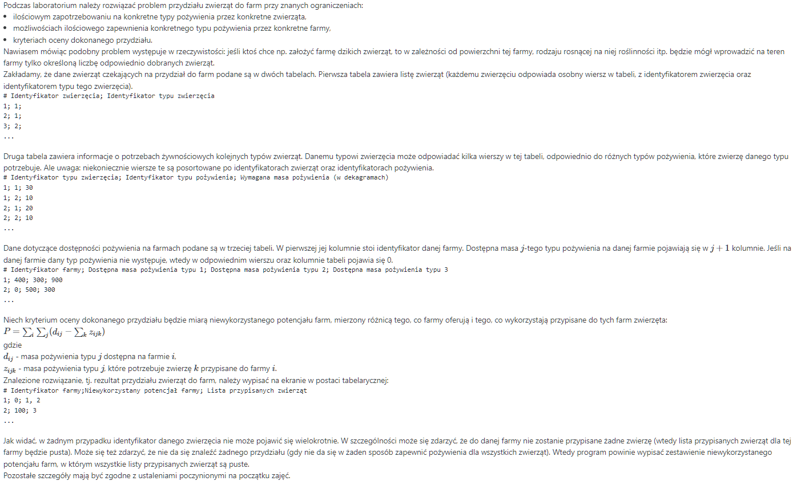

# Lab2-FarmOptimalization
Project for laboratory Języki Programowania 

Kompilacja: javac main/Main.java -encoding UTF8
 * Budowanie: jar cfm lab02_pop.jar Manifest.txt *
 * Uruchamianie: java -jar lab02_pop.jar ListAnimalsFood.txt ListAnimalsIndex.txt ListFarms.txt (Aby uruchomić, należy dostarczyć pliki .txt. Aby dostać domyślne, należy przed uruchomieniem rozpakować jar komendą: jar xf lab02_pop.jar )
 * (Jeśli nie chcemy korzystać z domyślnych, należy utworzyć folder "parameters", a do niego wrzucić pliki .txt
 * Działanie programu: Progam ma na celu jak najlepiej dopasować zwierzęta do farm, w taki sposób, aby po przydzieleniu zwierząt do farm, suma niewykorzystanego jedzenia na wszystkich farmach była jak najmniejsza.
 * Z 3 plików tekstowych są wczytywane dane do programu:
 * 1. ListAnimalsIndex.txt - INDEX ZWIERZĘCIA;TYP ZWIERZĘCIA
 * 2. ListFarms.txt - INDEX FARMY;ILOŚĆ JEDZENIA N-tego TYPU;ILOŚĆ JEDZENIA N+1-ego TYPU;...
 * 3, ListAnimalsFood.txt - TYP ZWIERZĘCIA;TYP POŻYWIENIA;ILOŚĆ ZAPOTRZEBOWANIA JEDZENIA DANEGO TYPU
 * 
 * Program dopasowuje poszczególne zwierzęta, na podstawie 3 kryteriów:
 * - ilości przypadków, gdzie: ilość N-tego typu jedzenia na farmie mod(ilość zapotrzebowanie zwierzęcia na N-ty typ jedzenia) = 0 (poszukiwanie farm, gdzie ilość pokarmu danego typu jest wielokrotnością zapotrzebowania zwierzęcia na dany typ jedzenia)
 * - ilości przypadków, gdzie: ilość N-tego typu jedzenia na farmie/ilość zapotrzebowanie zwierzęcia na N-ty typ jedzenia = 1  (poszukiwanie farm, gdzie zapotrzebowanie zwierzęcia na dany typ jedzenia, idealnie wpasowuje się ilość pokarmu danego typu na farmie)
 * - sumie różnic, pomiedzy ilością jedzenia danego typu na farmie, a zapotrzebowaniem na nie u danego zwierzęcia (im suma jest mniejsza tym lepiej)
 * Jako odpowiedź, program wypisuje: INDEX FARMY;SUMA ILOŚCI WSZYSTKICH TYPÓW ŻYWNOŚCI NA FARMIE PO PRZYDZIELENIU ZWIERZĄT;INDEXY ZWIERZĄT PRZYPISANYCH DO FARMY
 * P = SUMA ILOŚCI WSZYTKICH TYPÓW ŻYWNOŚCI Z KAŻDEJ FARMY PO PRZYDZIELENIU ZWIERZĄT

